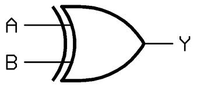
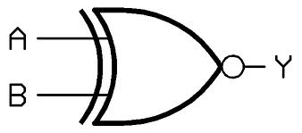

**XOR** x(exclusive OR)

For a 2 input XOR, the output of the gate is low when both the inputs are same (either both low or both high). The output is high if one and only one of the inputs is high. The function is addition modulo 2 and hence the gate is used in half adder
The schematic and truth table for 2 input A and B for XOR gate :-

**SCHEMATIC OF XOR GATE**

|Input A | Input B | Output|
|--------|---------|-------|
|0       | 	0  | 	0  |
|0 	 |  1  	   |  1    |
|1       | 	0  | 1     |
|1       | 	1  | 0     |

**XNOR** (exclusive OR)

For a 2 input XNOR, the output of the gate is high when both the inputs are same(either both low or both high). The output is low if one and only one of the inputs is high.
The schematic and truth table for 2 input A and B for XOR gate :-

**SCHEMATIC OF XNOR GATE**

|Input A | Input B | Output |
|--------|---------|--------|
|0       |0        |1       |
|0       |1        |0       |

