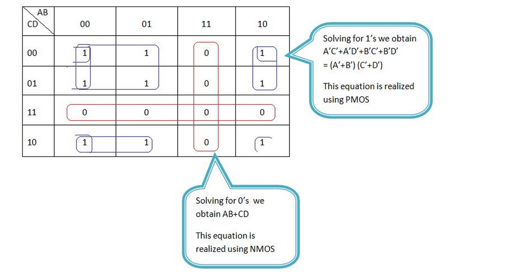
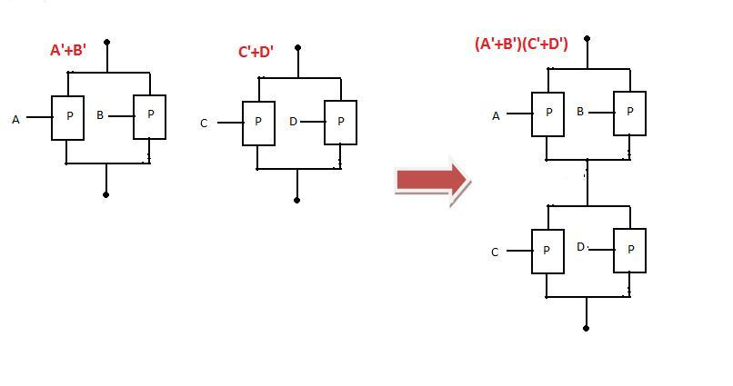
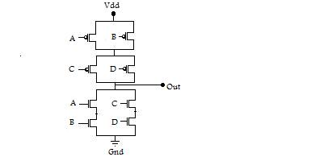

Having gained sufficient knowledge about series and parallel connection, we now move towards desining transistor level schematic for any given combinational logic. This is done by analysing the kmap of the given combination for p- and n- switches and then deducing the required series or parallel combination. The following example will give you an idea about how to go for designing a combinational logic using transistors. We want to design transistor level schematic of (AB+CD)

**K-MAP**

**IMPLEMENTATION FOR N-SWITCHES**

The series combination of A and B is in parallel with the series combination of C and D.

**IMPLEMENTATION FOR P-SWITCHES**

The parallel combination of A and B is in series with the parallel combination of C and D.

The complete design will be as shown in the figure below

**XOR**

A ⊕ B = AB' + A'B

A is analogous to C, A' is analogous to A and B' is analogous to D. If implementation is done according to the example described above we would require 5 NMOS and 5 PMOS.
4 NMOS and PMOS for implementation of complement of AB+CD and 1 pair for the inverter.
Now, think of a method to reduce the number of transistor. 1 pair needed for inverting can be reduced if XOR is implemented as the complement of XNOR.

**XNOR**

A XNOR B = AB + A'B'. In a similar way, xnor if implemented as complement of A ⊕ B rather than AB+A'B' would require 4 NMOS and PMOS. In that case B' would be analougos to B, B to D and A' to C in the above example.

