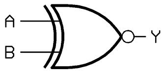
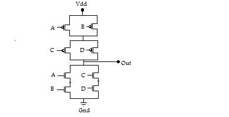

### XOR (Exclusive OR)

The XOR gate outputs high (1) only when the inputs are different. For a 2-input XOR, the output is low (0) when both inputs are the same (either both low or both high). XOR implements addition modulo 2 and is widely used in half-adder circuits.

**Schematic:**  

**Truth Table:**

| Input A | Input B | Output |
| ------- | ------- | ------ |
| 0       | 0       | 0      |
| 0       | 1       | 1      |
| 1       | 0       | 1      |
| 1       | 1       | 0      |

---

### XNOR (Exclusive NOR)

The XNOR gate outputs high (1) when both inputs are the same (either both low or both high). The output is low (0) if one and only one of the inputs is high.

**Schematic:**  

**Truth Table:**

| Input A | Input B | Output |
| ------- | ------- | ------ |
| 0       | 0       | 1      |
| 0       | 1       | 0      |
| 1       | 0       | 0      |
| 1       | 1       | 1      |

---

### CMOS Implementation Concepts

In CMOS logic, series and parallel connections of transistors are used to realize logic gates. For example, the parallel combination of A and B can be placed in series with the parallel combination of C and D to implement more complex functions.

**Example Design:**  

---

### XOR Gate Implementation

The XOR function can be expressed as:

$$A \oplus B = AB' + A'B$$

To implement XOR using CMOS:

- 5 NMOS and 5 PMOS transistors are typically required.
- 4 NMOS/PMOS pairs for the main logic, and 1 pair for the inverter.
- The number of transistors can be reduced if XOR is implemented as the complement of XNOR.

---

### XNOR Gate Implementation

The XNOR function can be expressed as:

$$A \text{ XNOR } B = AB + A'B'$$

XNOR can be implemented as the complement of XOR, which reduces the required number of transistors to 4 NMOS and 4 PMOS pairs.

---

### Design Approach Using K-Map

To design a transistor-level schematic for any combinational logic:

1. Analyze the Karnaugh map (K-map) for the required logic function.
2. Deduce the series and parallel connections for p- and n- switches.
3. Construct the CMOS schematic accordingly.

**Example:**  
Design the transistor-level schematic for $\overline{AB + CD}$.
